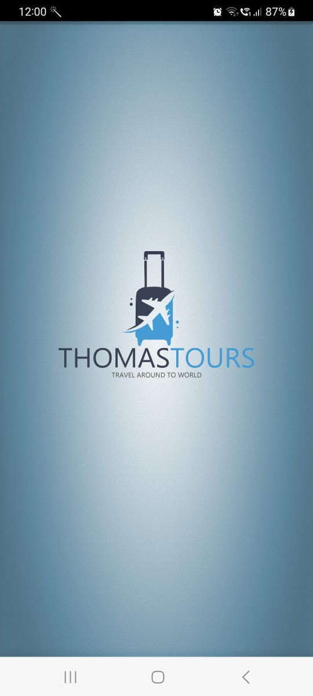
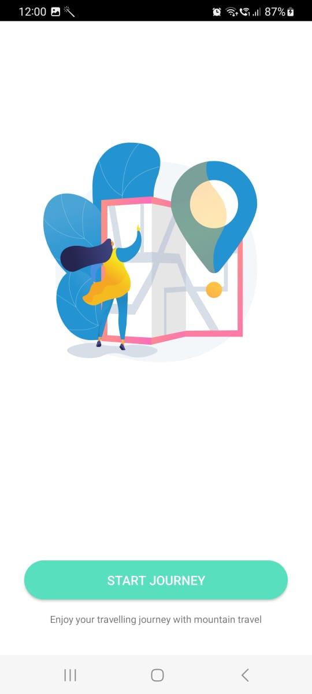
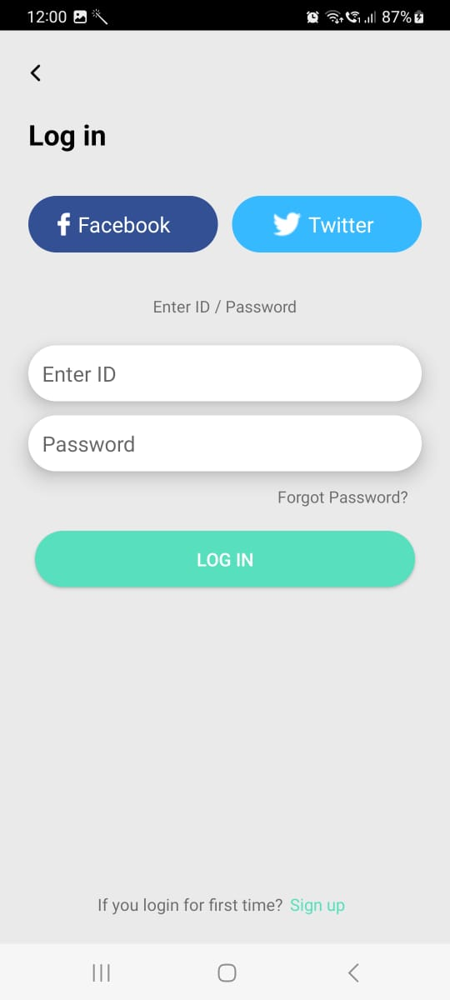
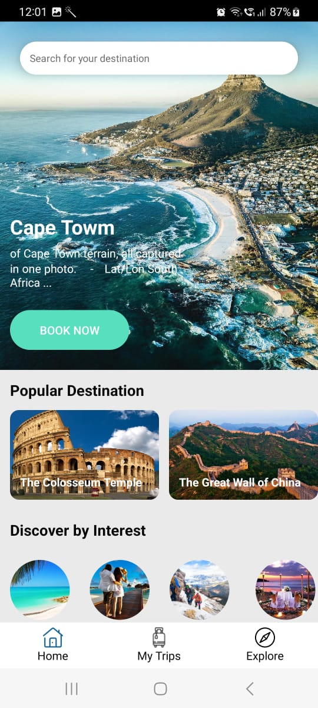
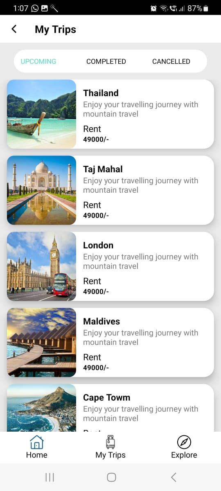
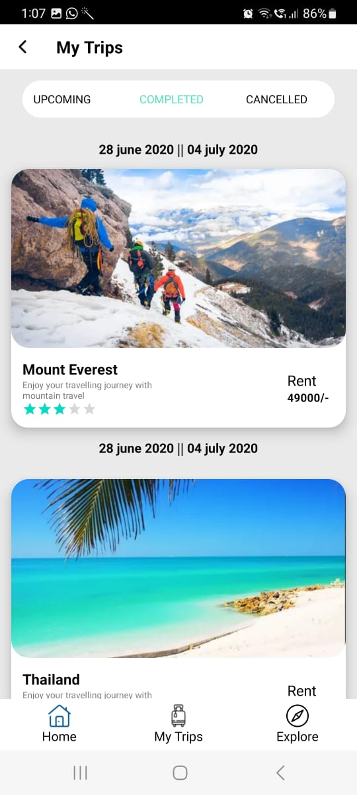
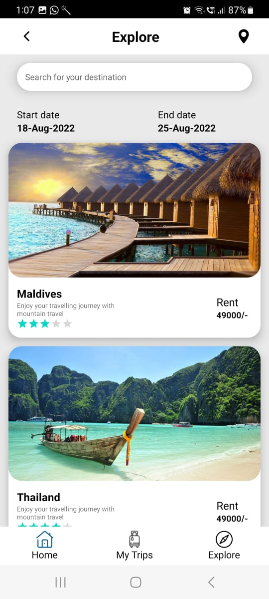

# Traveler App UI

This repository contains the user interface (UI) code for the Traveler App, a simple application designed to help users plan and organize their travel experiences.

## Features

- Clean and intuitive user interface
- Responsive design for various screen sizes
- Attractive and visually appealing layouts
- Easy navigation and user-friendly interactions

## Screenshots











## Getting Started

### Prerequisites

- Ensure you have [Node.js](https://nodejs.org/) installed on your machine.

### Installation

1. Clone the repository:

   ```bash
   git clone https://github.com/ShiroyaShubham/TravelApplication.git
